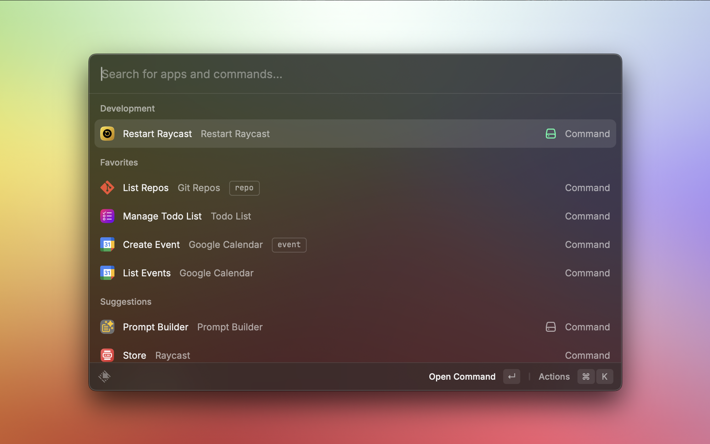
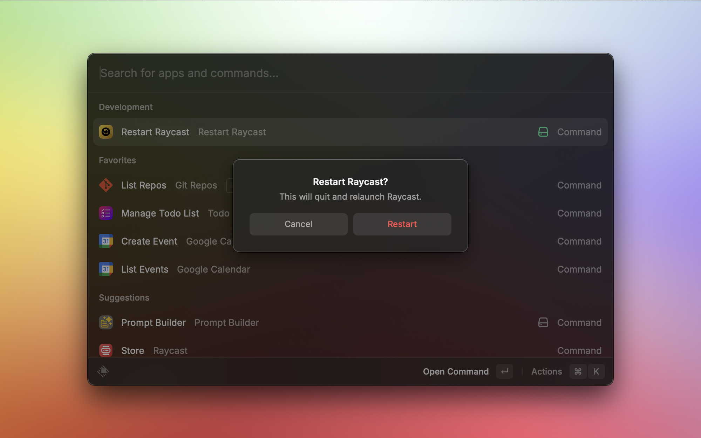

# Restart Raycast

A small Raycast extension that quits and relaunches Raycast to clear its RAM usage. It uses a short AppleScript under the hood and does nothing else.
If you’ve ever seen Raycast climb to hundreds of megabytes (or more), this gives you a quick reset button.

## Requirements

Before installing, make sure you have:

- Raycast 1.26.0 or higher

- [Node.js 22.14](https://nodejs.org/en) or higher. If you don’t have Node, the easiest way is to install it with [nvm](https://github.com/nvm-sh/nvm).

- [npm](https://www.npmjs.com/) 7 or higher (comes with Node)

## Usage

1. Clone the repository locally on your computer.

2. Open Raycast and choose **Import Extension**.

3. Inside the project folder, run:
    - `npm install`
    - `npm run build`

4. After that, the command **Restart Raycast** will appear in Raycast. Run it whenever Raycast starts consuming too much RAM.

### Notes

- Works on macOS only.

- The restart uses Raycast’s normal quit flow. It doesn’t force-quit anything.

------------------------

